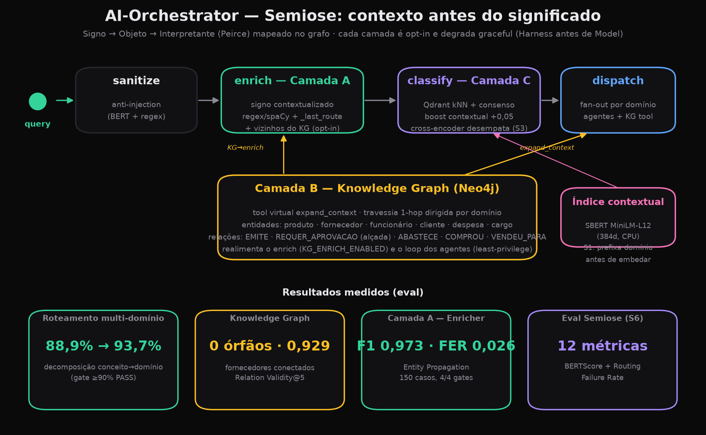

##### AI-Orchestrator

**AI Gateway multi-agente 100% on-premise**: um orquestrador MoE roteia perguntas de negócio para subagentes especialistas que executam tool-calling contra microsserviços FastAPI determinísticos. A regra de negócio vive na API — nunca no modelo.

PoC de portfólio com **números medidos em hardware consumer** (RTX 3060 12 GB + 14 GB RAM): todos os gates abaixo foram executados, não estimados. Modelo de produção: **Qwen3.5-9B LoRA** (fine-tuned via Unsloth, GGUF Q4_K_M 5.4 GB, 100% GPU).

---

Resultados (medidos)

| Gate                             | LoRA 9B (prod)                                                              | Baseline 9B    | Baseline 7b     | Critério       |
| -------------------------------- | --------------------------------------------------------------------------- | -------------- | --------------- | --------------- |
| Subagentes por domínio          | **35/40 = 87.5%** (fin 90, rh 90, est 90, ven 80)                    | 87.5%          | 82.5%           | ≥ 80%/domínio |
| Roteamento (64 perguntas)        | **90.5% PASS** (63 queries)                                           | 95.5%          | 90.5%           | ≥ 90%          |
| Injection                        | **0/6 vazamentos**                                                    | 0/6            | 0/6             | 0 leaks         |
| Testes determinísticos          | **182 passando** (regras de negócio + gateway)                       | —              | —               | 100%            |
| Demo multi-domínio SSE          | **end-to-end OK** (3 domínios, fan-out/fan-in)                       | —              | —               | funcional       |

> **LoRA 9B vs baselines**: domains +5 pp vs 7b, routing empata, injection perfeito em todos. LoRA roda 100% GPU (5.4 GB Q4_K_M) a ~2–4 s/task vs 30b MoE a ~15 s/task com split CPU.

---

Arquitetura

```
                       ┌────────────────────────────────────────────────┐
                       │  Gateway (FastAPI, porta 8100)                 │
 cliente ─ POST /chat ▶│  LangGraph: sanitize → enrich → classify ─┬ clarif.│
           (SSE)       │  enrich = Camada A (ctx + KG, opt-in)     │        │
                       │  classify = semântico→LLM→léxico          │        │
                       │            dispatch (fan-out) ───────────┤        │
                       │            synthesize (fan-in) ───┘            │
                       └──────┬───────────────┬──────────────┬──────────┘
                              │ tools         │ /api/chat    │ kNN cosine
               X-Internal-Key │ (OpenAPI)     │ /api/embed   ▼
     ┌──────────┬─────────────┼──────────┐  ┌─▼───────────┐ ┌─────────────┐
     ▼          ▼             ▼          ▼  │Ollama 11435 │ │Qdrant 6333  │
┌─────────┐┌─────────┐ ┌─────────┐┌─────────┐ chat: MODEL │ │ routing_    │
│financas ││   rh    │ │ estoque ││ vendas  │ embed: SBERT│ │ examples    │
│  :8101  ││  :8102  │ │  :8103  ││  :8104  │ (gateway)   │ │ (golden set │
└─────────┘└─────────┘ └─────────┘└─────────┘ residente   │ │ 64 exemplos)│
 FastAPI + Pydantic v2 + SQLite WAL por svc └─────────────┘ └─────────────┘
 regras de negócio determinísticas, erro 422 {error, detail, rule}
```

**Decisões medidas, não assumidas:**

| Decisão                                                       | Por quê (medição)                                                                                                                                                                                                           |
| -------------------------------------------------------------- | ------------------------------------------------------------------------------------------------------------------------------------------------------------------------------------------------------------------------------ |
| **LoRA 9B como modelo de produção** em vez de MoE 30B | MoE 30B (17 GB) exigia split CPU/GPU: ~15 s/task. LoRA 9B (5.4 GB Q4_K_M) roda 100% GPU: ~2–4 s/task. Fine-tune em 3.050 exemplos (1.325 trajetórias + 1.569 routing + 156 injection) via Unsloth LoRA bf16 no Colab A100. Domains +5 pp vs 7b base; routing/injection mantidos. |
| `think=true` só no qwen3 (não qwen3.5)                      | Qwen3.5 Small series não suporta `<think>` — Ollama rejeita `think=true`. Qwen3 (MoE) precisa pra evitar CoT vazando no `content`. Detecção automática em `llm.py`.                               |
| Tools geradas do `openapi.json`                              | Única fonte de verdade é a API; schema drift impossível. 422/404 voltam como **observação** pro loop do agente, nunca exceção.                                                                                   |
| `LLM_TIMEOUT_S=900` no gateway                               | Fan-out de 3 agentes enfileira no MoE único (Ollama serializa): o 3º agente espera ~2 loops inteiros — 300 s estourava (medido na demo).                                                                                    |
| **Semantic router como cache, não como classificador** (Qdrant kNN, threshold 0.92 + consenso unânime + score gap ≥0.05) | Com threshold 0.80 o eval leave-one-out caiu pra 84.1%: vizinhos a score 0.83–0.88 com conjuntos de domínios diferentes erravam os casos multi-domínio. A banda 0.80–0.90 não separa acerto de erro; a 0.92 a camada só dispara em pergunta quase idêntica e o LLM classifier decide o resto. Score gap filter (`min_score_gap=0.05`) rejeita hits onde top-1 e top-2 estão muito próximos (ambiguidade). |
| **SBERT embeddings substituíram nomic-embed-text** | `paraphrase-multilingual-MiniLM-L12-v2` (384 dim, CPU, ~120 MB) roda no gateway via sentence-transformers — sem dependência do Ollama para embeddings. Embedder Protocol (`SBERTEmbedder` + `OllamaEmbedder` fallback) garante degradação graceful. |
| **Injection detector BERT fine-tunado** | BERTimbau (`neuralmind/bert-base-portuguese-cased`) fine-tunado com 400 exemplos sintéticos (200 injection + 200 legítimos). 100% accuracy na validação. Classifier binário no gateway (`gateway/injection_classifier.py`), modelo 417 MB em volume mount `./models:/app/models`. |

Semiose — pipeline contextual (Camadas A/B/C)

Camada de compreensão contextual inspirada na semiose triádica de Peirce (Signo → Objeto → Interpretante), mapeada em pontos do grafo. Cada camada é **opt-in por flag** e degrada graceful (Harness antes de Model).



- **Camada A — `enrich`** (`gateway/query_enricher.py`): nó entre `sanitize` e `classify`. Reconstrói a query com contexto estruturado (domínio do turno anterior `_last_route` + entidades via regex/spaCy) **sem chamar LLM**. Opcionalmente realimenta com vizinhos 1-hop do Knowledge Graph (`KG_ENRICH_ENABLED`).
- **Camada B — Knowledge Graph** (`gateway/knowledge_graph.py`, Neo4j): **tool virtual** `expand_context` registrada no `ToolRegistry` — o agente decide se/quando expandir (least-privilege, protegida por circuit breaker). Seed idempotente em `scripts/seed_neo4j.py`: entidades (produto, fornecedor, funcionário, cliente, despesa, cargo) e relações (`EMITE`, `REQUER_APROVACAO` por alçada, `ABASTECE`, `COMPROU`, `VENDEU_PARA`) — **0 fornecedores órfãos**.
- **Camada C — re-rank no SemanticRouter** (`gateway/semantic_router.py`): boost contextual aditivo (+0,05) quando há `context_domain`; **cross-encoder como desempate** (S3) restrito ao top-2 ambíguo (domínios diferentes + gap pequeno). Índice contextual S1: prefixa o domínio do exemplo antes de embedar no Qdrant.

| Métrica (eval) | Resultado |
|---|---|
| Roteamento multi-domínio (decomposição conceito→domínio no prompt) | **88,9% → 93,7%** (gate ≥90% PASS) |
| KG — fornecedores órfãos · Relation Validity@5 | **0** · **0,929** |
| Camada A — Entity Propagation F1 · FER | **0,973** · **0,026** (150 casos, 4/4 gates) |
| Eval Semiose (`evals/eval_semiose.py`) | **12 métricas** (BERTScore opcional + Routing Failure Rate) |

> Flags: `ENRICHER_ENABLED`, `SPACY_ENABLED`, `NEO4J_ENABLED`, `KG_ENRICH_ENABLED`, `RERANK_ENABLED`, `CONTEXT_BOOST`, `CONTEXTUAL_EMBEDDINGS_ENABLED`, `RERANK_CROSS_ENCODER_ENABLED`. Plano e desvios detalhados em `PLANO_SEMIOSE.md`.

Latências medidas (warm, RTX 3060 + split CPU)

| Etapa                                                                    | Latência típica         |
| ------------------------------------------------------------------------ | ------------------------- |
| Classify — hit semântico (Qdrant kNN, pergunta já conhecida)            | **~0.1 s**               |
| Classify — LLM (pergunta nova)                                           | 15–70 s                  |
| Task single-domain LoRA 9B (loop 2–4 iterações)                      | **2–4 s** (100% GPU)    |
| Task single-domain MoE 30B (split CPU/GPU)                               | 26–216 s (mediana ~55 s) |
| Caso demo 3 domínios end-to-end (route → fan-out paralelo → síntese) | **~30 s** (LoRA 9B)     |
| Cold load LoRA 9B (uma vez por boot)                                     | ~3 s                      |

> LoRA 9B cabe inteiro na RTX 3060 (5.4 de 12 GB). Latência de produção real, não de demo.

Segurança

- **Sanitização no boundary** (`gateway/sanitize.py`): strip de tokens especiais ChatML (`<|...|>`) e wrapper tags antes de qualquer LLM.
- **Semantic injection detection** (`gateway/sanitize.py`): 14 padrões regex (PT/EN) detectam tentativas de injection semântica ("ignore as instruções...", "you are now...", "act as...", "system prompt", etc.). **Log-only** — não reescreve o texto (mutilar keywords destrói perguntas legítimas); a defesa ativa é o system prompt + isolamento por tag + least-privilege.
- **Injection classifier BERT** (`gateway/injection_classifier.py`): BERTimbau fine-tunado (400 exemplos, 100% val accuracy) como segunda camada de detecção. Modelo 417 MB montado via volume `./models:/app/models`. Training script e dataset sintético em `train/`.
- **Router endurecido**: instruções injetadas ("ignore as instruções...", "agora você é...", falsa autoridade) não adicionam domínios à rota. 1º eval: 2/6 vazamentos de roteamento (zero tool-calls cross-domain — least-privilege segurou) → regra de segurança + exemplo adversário no prompt → **0/6**.
- **Anti-fabricação no system prompt**: regra crítica proíbe o agente de fabricar dados em operações de escrita. Se o usuário não forneceu todos os campos obrigatórios, o agente lista os campos e pede ao usuário — nunca inventa nomes, salários, datas, quantidades ou IDs.
- **Least-privilege por escopo**: cada subagente só enxerga as tools do seu domínio — mesmo "convencido", não tem como chamar outra API.
- **API key interna** (`X-Internal-Key`, `hmac.compare_digest`): serviços recusam chamada que não venha do gateway (401).
- **Fail-closed auth** (`gateway/security.py`): sem `ACCESS_TOKEN` configurado, `/chat` é bloqueado por padrão. Modo dev aberto requer `ALLOW_OPEN_ACCESS=1` explícito.
- **Rate limiting por IP** (`RATE_LIMIT_PER_HOUR`, default 10): sliding window em memória por processo com `max_entries=10000` + eviction periódico (proteção contra memory exhaustion por IP spoofing). **CF-Connecting-IP** como fonte confiável de IP real atrás do Cloudflare (não spoofável pelo cliente); fallback chain: `CF-Connecting-IP` → `X-Real-IP` → `X-Forwarded-For` → socket.
- **Qdrant API key auth** (`QDRANT__SERVICE__API_KEY`): banco vetorial protegido por API key, não mais exposto sem autenticação.
- **Langfuse secrets obrigatórios** (`LANGFUSE_NEXTAUTH_SECRET`, `LANGFUSE_SALT`): sem defaults inseguros — compose é fail-closed.
- **SQLite WAL mode + busy_timeout** em todos os 4 microsserviços: `PRAGMA journal_mode=WAL` + `PRAGMA busy_timeout=5000` previne `database is locked` em fan-out concorrente.
- **Auditoria completa**: 0 CRITICO, 0 ALTO, 0 MEDIO (relatório em `docs/AUDIT_2026-06-14.md`).
- **Circuit breaker por domínio**: 3 falhas de transporte → OPEN 30 s → half-open. 4xx (regra de negócio) não conta como falha.
- **Swagger/OpenAPI desabilitado em produção**: `docs_url=None`, `redoc_url=None`, `openapi_url=None` no gateway.
- **Error sanitization**: stack traces nunca expostos no SSE — erros internos retornam mensagem genérica ("Erro interno. Tente novamente.") com log completo no servidor.
- **`.dockerignore`** (root + services): `.env`, `__pycache__`, `.git` e outros artefatos excluídos das layers Docker.
- **Dedicated thread pool** (`MAX_GRAPH_WORKERS=4`): execução síncrona do grafo roda em pool dedicado, não compete com o event loop asyncio.
- **Request deadline** (`REQUEST_TIMEOUT_S=600`): timeout global por request SSE, independente do `LLM_TIMEOUT_S`. Heartbeat a cada 15 s mantém a conexão viva; excedido o deadline, retorna erro ao cliente.

Endpoints dos microsserviços (CRUD completo)

Todos os microsserviços usam FastAPI + Pydantic v2 + SQLite. Erros de regra de negócio retornam 422 `{error, detail, rule}`.

| Serviço | Porta | Endpoints |
|---------|-------|-----------|
| **Finanças** | 8101 | `GET /accounts` (filtro por type/status), `GET /accounts/{id}`, `POST /accounts`, `PUT /accounts/{id}`, `DELETE /accounts/{id}` (só abertas), `POST /accounts/{id}/pay`, `POST /accounts/{id}/receive`, `GET /cashflow` (start/end) |
| **RH** | 8102 | `GET /employees` (filtro por department, COLLATE NOCASE), `GET /employees/{id}`, `POST /employees`, `PUT /employees/{id}` (department/position/salary), `DELETE /employees/{id}`, `GET /employees/{id}/vacation-balance`, `POST /vacations`, `POST /reimbursements`, `GET /headcount` (filtro por department, COLLATE NOCASE) |
| **Estoque** | 8103 | `GET /products` (filtro por category), `GET /products/{sku}`, `POST /products` (SKU único), `PUT /products/{sku}` (name/quantity/reorder_point), `DELETE /products/{sku}` (sem reservas ativas), `GET /reservations`, `POST /reservations`, `POST /reservations/{id}/release`, `GET /replenishment` |
| **Vendas** | 8104 | `GET /orders`, `GET /orders/{id}`, `POST /orders` (validação de desconto por política), `PUT /orders/{id}`, `DELETE /orders/{id}`, `GET /orders/{id}/commission`, `GET /sellers`, `GET /sellers/{id}`, `POST /sellers`, `PUT /sellers/{id}`, `DELETE /sellers/{id}` |

Observabilidade

`trace_id` por request propagado pelo grafo; log JSON estruturado por no (no, latencia, dominios). Eventos SSE em tempo real: `route` -> `agent` (um por subagente concluido) -> `final`.

**Langfuse tracing** (Cloud): trace por request, span por no do grafo, generation por chamada LLM. Gateway conecta ao **Langfuse Cloud** (`LANGFUSE_HOST=${LANGFUSE_HOST:-https://us.cloud.langfuse.com}`) por padrao. Containers Langfuse v2 self-hosted + Postgres permanecem no `docker-compose.yml` como fallback (basta alterar `LANGFUSE_HOST`). Degradacao graceful — Langfuse fora nao bloqueia requests.

**Endpoints de metricas e evals (auth-guarded):**
- `GET /metrics` — metricas agregadas do Langfuse (traces, latencias, tokens, custo). Cache de 30 s. Servido por `gateway/metrics.py`.
- `GET /eval-results` — resultados agregados de routing accuracy + injection F1 a partir de `evals/results/*.json`. Cache de 60 s. Servido por `gateway/eval_results.py`. Volume `./evals/results:/app/evals/results:ro` montado read-only no container gateway.

**Estado conversacional**: `MemorySaver` checkpointer com `thread_id` por sessao. Frontend persiste thread em localStorage; botao "Nova conversa" reseta contexto.

**HITL (Human-in-the-Loop)**: no `confirm_dispatch` com `interrupt()` do LangGraph + endpoint `POST /chat/{thread_id}/resume`. Ativação seletiva por **write intent determinístico** (`gateway/write_intent.py`: léxico PT das write ops dos serviços; leitura nunca pausa, frases nominais como "contas a pagar" excluídas). Opt-in via `HITL_ENABLED=1`.

Como rodar

```bash
docker compose up -d --build          # ollama + gateway + 4 microsserviços + qdrant + langfuse
# SBERT embeddings baixam automaticamente no build do gateway (paraphrase-multilingual-MiniLM-L12-v2)
# modelo LoRA: copiar qwen3.5-9b-orch.Q4_K_M.gguf + Modelfile para o container
# docker exec ai-orchestrator-ollama ollama create qwen3.5-9b-orch -f /tmp/Modelfile

# pergunta multi-domínio via SSE
curl -N -X POST localhost:8100/chat -H 'content-type: application/json' \
  -d '{"question": "Posso aceitar um pedido de 100 unidades do SKU TEC-MEC-005 com 15% de desconto?"}'
```

Interface web

3 páginas (Vite + React + Tailwind v4) servidas pelo próprio gateway:

- **Chat** — trace multi-agente ao vivo: chips de roteamento por domínio, card por subagente concluído (fan-out visível), síntese final, cronômetro honesto para a latência do modelo local.
- **Dashboard** — métricas Langfuse (traces, latências, tokens, custo) via `GET /metrics` com cache 30 s.
- **Evals** — routing accuracy + injection F1 via `GET /eval-results`, agregados de `evals/results/*.json` com cache 60 s.

Navegação: **Chat | Dashboard | Evals | Nova conversa/← Início | Apresentação**.

```bash
# desenvolvimento (proxy /chat → gateway em :8100)
cd frontend && npm install && npm run dev

# build de produção (o Dockerfile do gateway já faz isso em multi-stage)
cd frontend && npm run build        # gateway serve frontend/dist na raiz
```

Exposição pública (suasalada.com.br) via Cloudflare Tunnel — profile `public`:

```bash
ACCESS_TOKEN=<token-do-chat> TUNNEL_TOKEN=<token-do-tunnel> \
  docker compose --profile public up -d --build
```

Boundary público em `gateway/security.py`: `X-Access-Token` comparado com `ACCESS_TOKEN` via `hmac.compare_digest` (sem a env, modo dev aberto) + rate limit em memória por IP (`RATE_LIMIT_PER_HOUR`, default 10, 429 ao exceder), honrando o primeiro hop de `X-Forwarded-For` atrás do Cloudflare.

Evals e testes:

```bash
python -m venv .venv && .venv/bin/pip install -r services/requirements.txt
.venv/bin/python -m pytest services gateway/tests -q        # 182 testes, sem LLM
INTERNAL_API_KEY=dev-internal-key .venv/bin/python evals/eval_domains.py    # 40 tasks
.venv/bin/python evals/eval_routing.py                       # 64 perguntas (golden set expandido)
.venv/bin/python evals/eval_routing.py --semantic            # + camada Qdrant (leave-one-out)
INTERNAL_API_KEY=dev-internal-key .venv/bin/python evals/eval_injection.py  # 6 casos
INTERNAL_API_KEY=dev-internal-key .venv/bin/python evals/demo.py            # 5 conversas
```

Estrutura

```
gateway/            # Experience Layer: graph (LangGraph), router (semântico→LLM→léxico), agents, sanitize, SSE
  main.py           #   FastAPI: POST /chat (SSE), POST /chat/{thread_id}/resume, GET /metrics, GET /eval-results
  graph.py          #   LangGraph StateGraph: sanitize → enrich → classify → dispatch → synthesize
  agents.py         #   loop de tool-calling por domínio + system prompt anti-fabricação
  router.py         #   classify_intent: semântico → LLM → léxico (decomposição multi-domínio, score gap filter)
  query_enricher.py #   Semiose Camada A: enrich contextual (regex/spaCy + _last_route + KG opt-in)
  knowledge_graph.py#   Semiose Camada B: adapter Neo4j + tool virtual expand_context (1-hop)
  semantic_router.py#   Semiose Camada C: Qdrant kNN + boost contextual + cross-encoder desempate (S3)
  sanitize.py       #   boundary anti-injection (ChatML strip + 14 regex + BERT classifier)
  security.py       #   AccessTokenGuard (fail-closed) + RateLimiter (max_entries + eviction) + client_ip
  config.py         #   Settings dataclass (todas as envs num lugar só)
  llm.py            #   cliente Ollama (chat/embed, think detection)
  embedder.py       #   Embedder Protocol (SBERTEmbedder + OllamaEmbedder fallback, 384 dim)
  injection_classifier.py  # BERTimbau fine-tunado (400 exemplos, 100% val accuracy)
  tracing.py        #   Langfuse integration (trace/span/generation) — Cloud default
  metrics.py        #   Langfuse trace aggregation (30s cache) → GET /metrics
  eval_results.py   #   Routing accuracy + injection F1 from evals/results/*.json (60s cache) → GET /eval-results
gateway/tools/      # registry OpenAPI→tools + circuit breaker
services/           # 4 microsserviços FastAPI (financas, rh, estoque, vendas) — CRUD completo
frontend/           # 3 páginas (Vite + React + Tailwind v4): Chat, Dashboard, Evals
evals/              # golden sets + gates (domains, routing, injection, demo, semiose)
  eval_semiose.py   #   Semiose: 12 métricas (Camadas A/B/C) + Routing Failure Rate + BERTScore
scripts/            # seed_neo4j.py (Knowledge Graph idempotente) + tests
train/              # LoRA fine-tune: build_dataset.py, colab notebooks, Modelfile
docs/               # PLANO_LORA_9B.md, SKILL_MULTIAGENT.md, AUDIT_2026-06-14.md, gen_diagrams.py (8 PNGs)
demo/               # transcripts gravados das 5 conversas
PLANO_EXECUCAO.md   # plano por fase com as-built e números medidos
PLANO_SEMIOSE.md    # Semiose: plano das Camadas A/B/C, desvios e resultados de eval
PROPOSAL.md         # visão do padrão AI Gateway
```

Gotchas documentados

1. **`threading.local()` para callbacks.** Lambdas (`on_agent`, `on_confirm`, trace) movidos de GraphState para `threading.local()` — MemorySaver/checkpointer não serializa funções (TypeError no msgpack).
2. **Estado residual entre turns.** Com checkpointer, `final_answer` do turn anterior persiste e engana conditional edges. Fix: `_sanitize` limpa campos de resultado a cada novo turn.
3. **Null payload no interrupt.** `interrupt()` pode yieldar payloads `None` no stream. Guard: `if not payload: continue`.
4. **Langfuse Cloud (default) / v2 self-hosted (fallback).** Gateway conecta ao Langfuse Cloud (`us.cloud.langfuse.com`) por padrão. Containers Langfuse v2 + Postgres mantidos no compose para fallback local (basta alterar `LANGFUSE_HOST`). Pin `langfuse/langfuse:2` (v3 requer ClickHouse).
5. **HITL com write-intent (opt-in `HITL_ENABLED=1`).** `interrupt()` só dispara para operações de escrita (write-intent determinístico em `gateway/write_intent.py`); leitura auto-aprova. Falso negativo auto-aprova — a regra de negócio vive na API; HITL é governança.
6. **COLLATE NOCASE para case-sensitivity SQLite.** LLMs enviam parâmetros em lowercase; SQLite default é case-sensitive. Todo filtro textual nos microsserviços usa `COLLATE NOCASE`.
7. **Fail-closed auth (`ALLOW_OPEN_ACCESS`).** Sem `ACCESS_TOKEN`, `/chat` é bloqueado. Modo dev aberto requer `ALLOW_OPEN_ACCESS=1` explícito.
8. **CF-Connecting-IP para IP real.** Cloudflare seta este header (não spoofável). Fallback: `X-Real-IP` → `X-Forwarded-For` → socket.
9. **Request deadline 600 s.** Timeout global por request SSE, independente do `LLM_TIMEOUT_S`. Heartbeat SSE a cada 15 s (Cloudflare corta após ~100 s sem bytes).
10. **Injection detection (14 patterns, log only).** Detecção semântica de injection (PT/EN) via regex em `sanitize.py`. Não reescreve — defesa ativa é system prompt + isolamento por tag + least-privilege.
11. **Anti-fabricação.** LLM inventa dados se o prompt não proibir explicitamente. Regra crítica no system prompt: para write ops sem todos os campos obrigatórios, listar campos e pedir ao usuário. Nunca fabricar nomes, salários, datas, quantidades. **Anti-fabricação para leitura**: nunca inventar dados ilustrativos em consultas — retornar apenas dados reais das APIs.
12. **SBERT substituiu nomic-embed-text.** `paraphrase-multilingual-MiniLM-L12-v2` (384 dim, CPU) roda no gateway via sentence-transformers. Embedder Protocol com fallback para Ollama. Elimina dependência de `ollama pull` para embeddings.
13. **Injection classifier BERT (417 MB).** Modelo montado via volume `./models:/app/models`. O diretório `models/` está no `.gitignore` (não versionar pesos). Script de treino em `train/`.

Backlog (fora do escopo da PoC)

- Reset de estado dos serviços entre runs de eval (resíduo financas-09: conta já liquidada de run anterior).
- Registry anexar campos do schema de resposta à description da tool (resíduo estoque-03: modelo julga capacidade da tool só pela descrição).
- Streaming token-a-token na síntese; RAG sobre documentos não estruturados.
